IPF Cell Atlas: Read-in
================

- [Environment](#environment)
- [Read in GSE136831](#read-in-gse136831)
- [Standard preprocessing](#standard-preprocessing)
  - [Filter overall dataset](#filter-overall-dataset)
  - [Proceed with epithelium](#proceed-with-epithelium)
- [Dot plots using mouse equivalent fibrotic DATP
  genes](#dot-plots-using-mouse-equivalent-fibrotic-datp-genes)

This version uses the Imran integration that has developmental cells
built-in.

# Environment

``` r
library(tidyverse)
library(Seurat)
library(SeuratWrappers)
library(monocle3)
library(RColorBrewer)
spectral.colors <- colorRampPalette(rev(brewer.pal(9,'Spectral')))
```

# Read in GSE136831

``` r
original.dir <- ('~/vcalab-files/datasets/GSE136831_IPF_Cell_Atlas/')
metadata <- read_tsv(paste0(original.dir,'GSE136831_AllCells.Samples.CellType.MetadataTable.txt.gz'))
```

    ## Rows: 312928 Columns: 9
    ## ── Column specification ────────────────────────────────────────────────────────
    ## Delimiter: "\t"
    ## chr (7): CellBarcode_Identity, CellType_Category, Manuscript_Identity, Subcl...
    ## dbl (2): nUMI, nGene
    ## 
    ## ℹ Use `spec()` to retrieve the full column specification for this data.
    ## ℹ Specify the column types or set `show_col_types = FALSE` to quiet this message.

``` r
metadata <- as.data.frame(metadata)
rownames(metadata) <- metadata$CellBarcode_Identity

features <- read_tsv(paste0(original.dir,'GSE136831_AllCells.GeneIDs.txt.gz'))
```

    ## Rows: 45947 Columns: 2
    ## ── Column specification ────────────────────────────────────────────────────────
    ## Delimiter: "\t"
    ## chr (2): Ensembl_GeneID, HGNC_EnsemblAlt_GeneID
    ## 
    ## ℹ Use `spec()` to retrieve the full column specification for this data.
    ## ℹ Specify the column types or set `show_col_types = FALSE` to quiet this message.

``` r
cells <- read_tsv(paste0(original.dir,'GSE136831_AllCells.cellBarcodes.txt.gz'), col_names = F)
```

    ## Rows: 312928 Columns: 1
    ## ── Column specification ────────────────────────────────────────────────────────
    ## Delimiter: "\t"
    ## chr (1): X1
    ## 
    ## ℹ Use `spec()` to retrieve the full column specification for this data.
    ## ℹ Specify the column types or set `show_col_types = FALSE` to quiet this message.

``` r
counts <- Matrix::readMM(paste0(original.dir,'GSE136831_RawCounts_Sparse.mtx.gz'))
rownames(counts) <- features$HGNC_EnsemblAlt_GeneID
colnames(counts) <- cells$X1
```

``` r
ipfatlas.cells <- CreateSeuratObject(counts=counts, meta.data=metadata)
```

    ## Warning: Data is of class dgTMatrix. Coercing to dgCMatrix.

``` r
rm(counts,cells,features,metadata)
gc()
```

    ##              used   (Mb) gc trigger    (Mb)   max used    (Mb)
    ## Ncells    9181117  490.4   16883534   901.7   16883534   901.7
    ## Vcells 1060783485 8093.2 3680181461 28077.6 4195220506 32007.0

# Standard preprocessing

## Filter overall dataset

``` r
ipfatlas.cells[['percent.mt']] <- PercentageFeatureSet(ipfatlas.cells, pattern='^MT-')
VlnPlot(ipfatlas.cells, features = c("nFeature_RNA", "nCount_RNA", "percent.mt"), ncol = 3, pt.size = 0)
```

    ## Warning: Default search for "data" layer in "RNA" assay yielded no results;
    ## utilizing "counts" layer instead.

    ## Rasterizing points since number of points exceeds 100,000.
    ## To disable this behavior set `raster=FALSE`
    ## Rasterizing points since number of points exceeds 100,000.
    ## To disable this behavior set `raster=FALSE`
    ## Rasterizing points since number of points exceeds 100,000.
    ## To disable this behavior set `raster=FALSE`

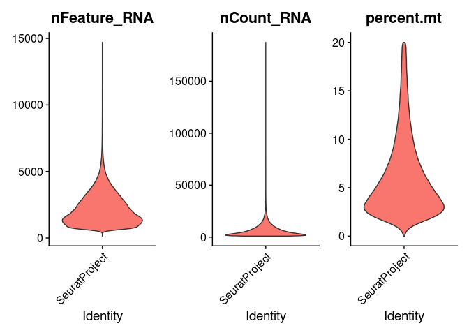<!-- -->

``` r
ipfatlas.cells <- subset(ipfatlas.cells, subset = nFeature_RNA > 200 & nFeature_RNA < 5000 & percent.mt < 10)
```

## Proceed with epithelium

``` r
ipfatlas.epi.cells <- subset(ipfatlas.cells, subset=CellType_Category=='Epithelial')
```

``` r
ipfatlas.epi.cells <- NormalizeData(ipfatlas.epi.cells)
```

    ## Normalizing layer: counts

``` r
ipfatlas.epi.cells <- FindVariableFeatures(ipfatlas.epi.cells)
```

    ## Finding variable features for layer counts

``` r
ipfatlas.epi.cells <- ScaleData(ipfatlas.epi.cells, features=rownames(ipfatlas.epi.cells))
```

    ## Centering and scaling data matrix

``` r
ipfatlas.epi.cells <- RunPCA(ipfatlas.epi.cells)
```

    ## PC_ 1 
    ## Positive:  CAPS, RNLS, FAM183A, C1orf194, C9orf24, C20orf85, PTPRT, SNTN, TSPAN1, ESRRG 
    ##     TPPP3, PIFO, C5orf49, TSPAN19, CETN2, DYNLRB2, C9orf116, MORN5, ENSG00000224479, MORN2 
    ##     PLAC8, CAPSL, C12orf75, ENSG00000277639, LINC01091, ENSG00000231621, C11orf88, ODF3B, TMEM190, FABP6 
    ## Negative:  SFTPB, NAPSA, SFTPC, SFTA2, CXCL2, SFTPA1, SFTPA2, SFTPD, NFKBIA, HOPX 
    ##     PTPRG, ABCA3, PEBP4, ZNF385B, DLC1, AFF3, RNASE1, ACOXL, LAMP3, PGC 
    ##     TMEM163, TCIM, CD44, S100A14, LPCAT1, ROS1, STX3, GAS5, ALPL, FABP5P7 
    ## PC_ 2 
    ## Positive:  SFTPC, SFTPA1, SFTPA2, LAMP3, ZNF385B, PGC, AFF3, SFTPD, CTSH, ABCA3 
    ##     WIF1, NAPSA, LRRK2, HHIP, ACOXL, AGBL1, SLC34A2, CSF3R, ENSG00000237413, CHI3L2 
    ##     DBI, MID1IP1, DLG2, CA2, ENSG00000254409, PEBP4, PLA2G1B, NPC2, ALPL, TMEM163 
    ## Negative:  TIMP1, HAS1, MIR4435-2HG, DST, ALDH1A3, PLA2G2A, PDPN, CALD1, ITLN1, PVT1 
    ##     COL6A2, PHLDB2, HEG1, CALB2, ANXA8, CYTOR, CAV1, EMP1, FHL2, GFPT2 
    ##     PALM2-AKAP2, ENSG00000256248, KRT17, DPYSL3, SPARC, UPK3B, ANXA8L1, TFPI2, KRT7, PRG4 
    ## PC_ 3 
    ## Positive:  AGER, NCKAP5, SPOCK2, RTKN2, EMP2, CAV1, SCEL, MYL9, KHDRBS2, TNNC1 
    ##     NTM, TIMP3, COL4A3, COL4A2, LINC01290, ENSG00000257894, CLIC5, ATF7IP2, MYO16, ANKRD29 
    ##     GGTLC1, CAV2, GPM6A, ST6GALNAC5, CLIC3, LAMA3, MAP2, CLDN18, ANKRD1, GPC5 
    ## Negative:  SLPI, C3, TIMP1, CXCL17, HP, ALDH1A3, CXCL1, SCGB3A1, PLA2G2A, HAS1 
    ##     SOD2, CXCL8, PVT1, ENSG00000244255, ENSG00000235979, NNMT, PIGR, RPS2, ITLN1, ENSG00000229119 
    ##     RPL7P9, NPC2, RARRES1, C4B, LCN2, BPIFB1, CLIC4, SGPP2, IL1R1, TFPI2 
    ## PC_ 4 
    ## Positive:  SCGB3A1, BPIFB1, SCGB1A1, TMEM45A, MDK, WFDC2, TSPAN8, LCN2, ECE1, LINC00511 
    ##     MMP7, AQP5, KRT17, S100A2, KLK11, ADAM28, RIMS1, MUC5B, AKR1C1, RHOV 
    ##     MIR205HG, TPM4, CXCL17, VMO1, PIGR, CAPN13, TMPRSS4, KRT7, EYA2, AKR1C2 
    ## Negative:  HAS1, PLA2G2A, ITLN1, CALB2, GFPT2, SLC16A1, PRG4, PTGIS, MEDAG, OGN 
    ##     VCAM1, NTNG1, ADAMTS9, WT1, LAMA4, MT1M, TEX26-AS1, BNC2, ROR2, COL6A2 
    ##     SLIT3, HP, PDPN, FLRT2, RBFOX1, CCDC80, GALNT9, ZFPM2, BCHE, DDR2 
    ## PC_ 5 
    ## Positive:  RPS12, RPS2, EEF1A1P5, RPS3, ENSG00000229119, TMSB10, ENSG00000235979, EEF1A1P13, FXYD3, ENSG00000242299 
    ##     RPL7P9, IFITM3, ENSG00000279483, DBI, SLPI, IFITM2, S100A10, SLC25A5, KRT18, NPC2 
    ##     RPL7P1, ENSG00000227615, WFDC2, RPS2P5, ENSG00000218175, GAS5, RPS23, CRIP1, MT1E, CXCL17 
    ## Negative:  TEX14, CCDC200, PDE4C, POLG2, DARS2, NFE2L3, TUBD1, TFCP2L1, TULP2, PLEKHG2 
    ##     ZSWIM4, MTO1, NUP210L, GALM, ENSG00000173727, ENSG00000268650, INTS6, MILR1, PARP16, GYS1 
    ##     ERCC1, MACROD2, ENSG00000283321, STPG4, ENSG00000253295, CEMIP2, GPRC5D-AS1, FBXL18, LINC00511, RPS6KB1

``` r
ipfatlas.epi.cells <- RunUMAP(ipfatlas.epi.cells, dims=1:30)
```

    ## Warning: The default method for RunUMAP has changed from calling Python UMAP via reticulate to the R-native UWOT using the cosine metric
    ## To use Python UMAP via reticulate, set umap.method to 'umap-learn' and metric to 'correlation'
    ## This message will be shown once per session

    ## 17:36:21 UMAP embedding parameters a = 0.9922 b = 1.112

    ## Found more than one class "dist" in cache; using the first, from namespace 'spam'

    ## Also defined by 'BiocGenerics'

    ## 17:36:21 Read 13370 rows and found 30 numeric columns

    ## 17:36:21 Using Annoy for neighbor search, n_neighbors = 30

    ## Found more than one class "dist" in cache; using the first, from namespace 'spam'

    ## Also defined by 'BiocGenerics'

    ## 17:36:21 Building Annoy index with metric = cosine, n_trees = 50

    ## 0%   10   20   30   40   50   60   70   80   90   100%

    ## [----|----|----|----|----|----|----|----|----|----|

    ## **************************************************|
    ## 17:36:23 Writing NN index file to temp file /tmp/RtmpVqPYCK/filee84b594460b3
    ## 17:36:23 Searching Annoy index using 1 thread, search_k = 3000
    ## 17:36:27 Annoy recall = 100%
    ## 17:36:28 Commencing smooth kNN distance calibration using 1 thread with target n_neighbors = 30
    ## 17:36:30 Initializing from normalized Laplacian + noise (using RSpectra)
    ## 17:36:31 Commencing optimization for 200 epochs, with 577658 positive edges
    ## 17:36:37 Optimization finished

``` r
DimPlot(ipfatlas.epi.cells, group.by='Manuscript_Identity')
```

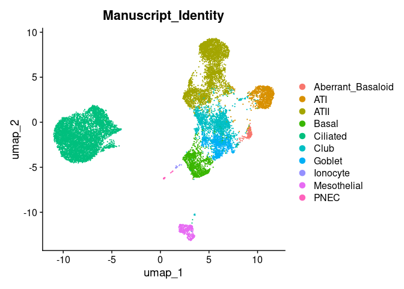<!-- -->

``` r
DimPlot(ipfatlas.epi.cells, group.by='Subclass_Cell_Identity')
```

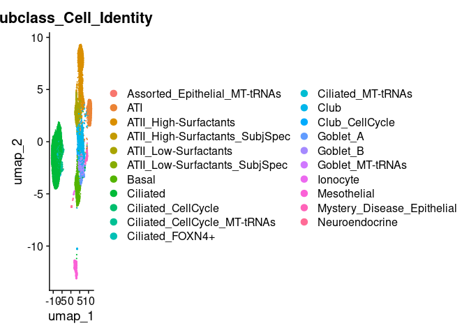<!-- -->

``` r
DimPlot(ipfatlas.epi.cells, group.by='Subject_Identity')
```

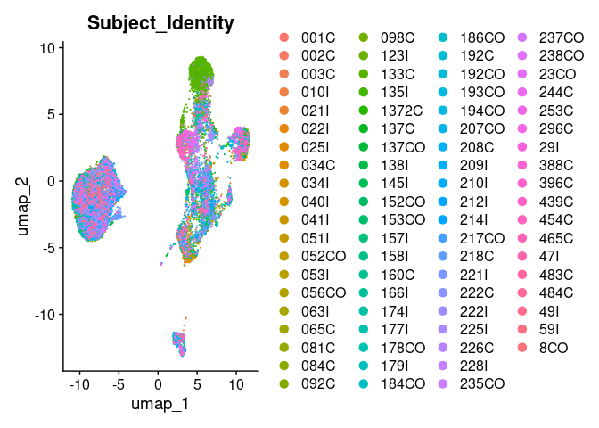<!-- -->

``` r
DimPlot(ipfatlas.epi.cells, group.by='Disease_Identity')
```

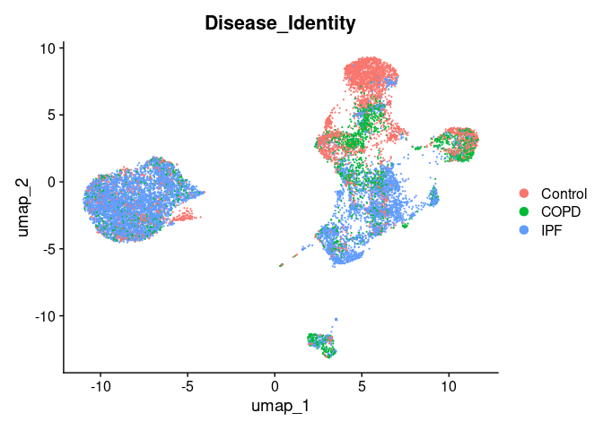<!-- -->

``` r
FeaturePlot(ipfatlas.epi.cells, features=c('CLDN4','KRT8','LGALS3','GDF15'))
```

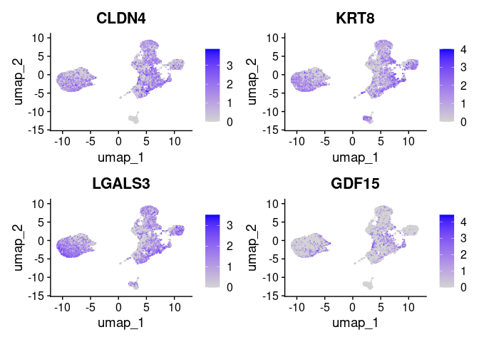<!-- -->

# Dot plots using mouse equivalent fibrotic DATP genes

Accepts the published annotations as accurate.

``` r
ipfatlas.epi.ipf.cells <- subset(ipfatlas.epi.cells, subset=Disease_Identity=='IPF')
ipfatlas.epi.ctrl.cells <- subset(ipfatlas.epi.cells, subset=Disease_Identity=='Control')
```

``` r
DotPlot(ipfatlas.epi.ipf.cells, features=c('CLDN4','KRT8','LGALS3','GDF15'),
        group.by='Manuscript_Identity')
```

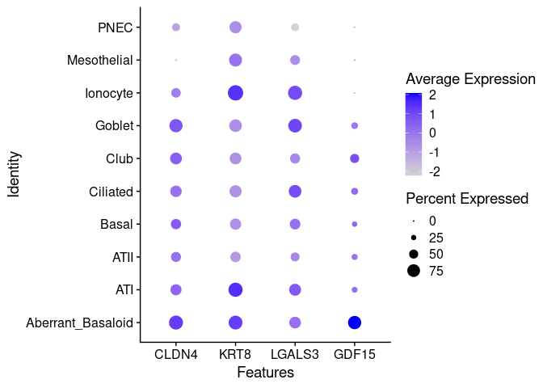<!-- -->

``` r
DotPlot(ipfatlas.epi.ctrl.cells, features=c('CLDN4','KRT8','LGALS3','GDF15'),
        group.by='Manuscript_Identity')
```

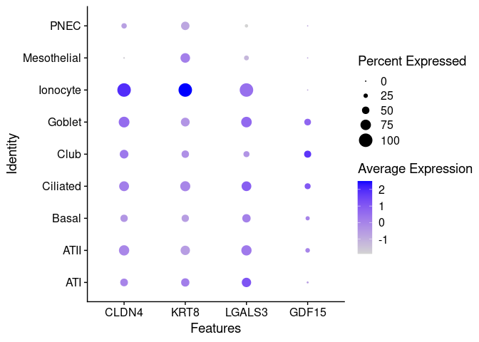<!-- -->

``` r
DotPlot(ipfatlas.epi.ipf.cells, features=c('CLDN4','KRT8','LGALS3','GDF15'),
        group.by='Subclass_Cell_Identity')
```

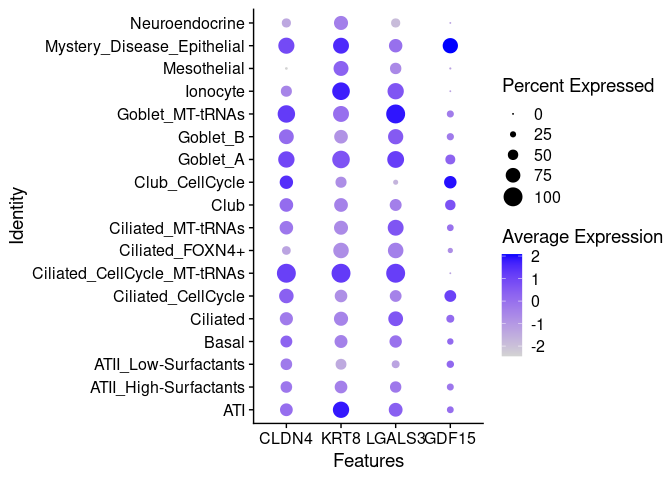<!-- -->

``` r
DotPlot(ipfatlas.epi.ctrl.cells, features=c('CLDN4','KRT8','LGALS3','GDF15'),
        group.by='Subclass_Cell_Identity')
```

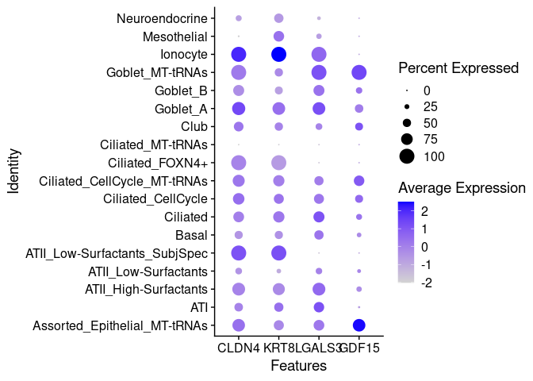<!-- -->

``` r
DotPlot(ipfatlas.epi.ipf.cells, features=c('KRT7','KRT8','LGALS3','TP63','KRT17','CLDN4','GDF15'),
        group.by='Manuscript_Identity',
        cols='Spectral')
```

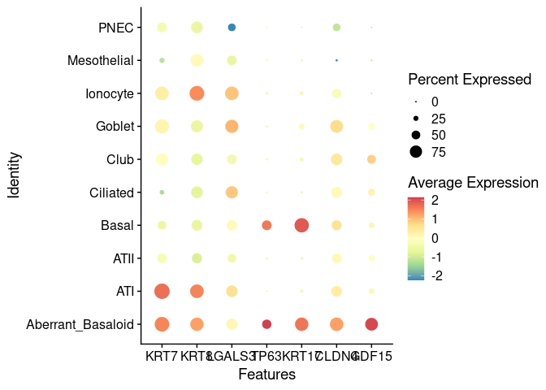<!-- -->
Collapse the non-basal airway cells

``` r
Idents(ipfatlas.epi.ipf.cells) <- 'Manuscript_Identity'
ipfatlas.epi.ipf.cells <- RenameIdents(ipfatlas.epi.ipf.cells,
                                       `Ionocyte`='Other Airway',
                                       `Goblet`='Other Airway',
                                       `Club`='Other Airway',
                                       `Ciliated`='Other Airway',
                                       `PNEC`='Other Airway')
```

``` r
DotPlot(ipfatlas.epi.ipf.cells, features=c('KRT7','KRT8','LGALS3','TP63','KRT17','CLDN4','GDF15'),
        cols='Spectral')
```

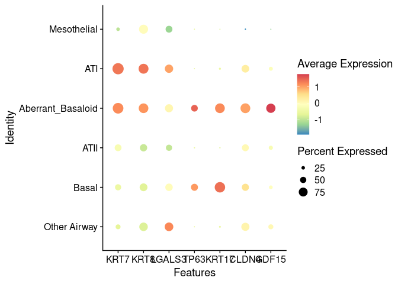<!-- -->
