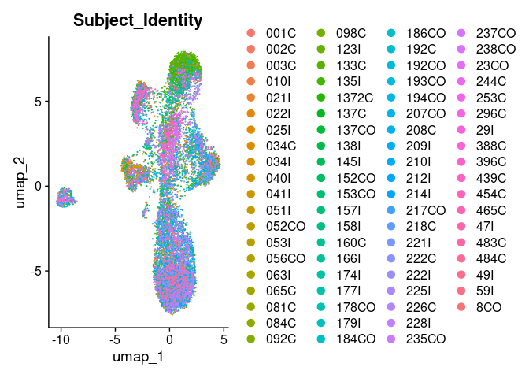
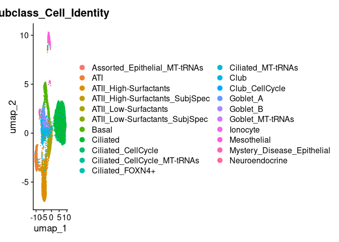

Simulation of restricted probesets for spatial transcriptomics
================

- [Environment](#environment)
  - [Read in IPF Cell Atlas
    (GSE136831)](#read-in-ipf-cell-atlas-gse136831)
- [Simulate Xenium lung panel 1](#simulate-xenium-lung-panel-1)
  - [Standard clustering](#standard-clustering)
  - [Subset epithelium](#subset-epithelium)
  - [Subset fibroblasts](#subset-fibroblasts)
- [Simulate Cosmx 1k panel](#simulate-cosmx-1k-panel)
  - [Standard clustering](#standard-clustering-1)
  - [Subset epithelium](#subset-epithelium-1)
  - [Subset fibroblasts](#subset-fibroblasts-1)

For probe-based spatial transcriptomics, the number and identity of
genes that have probesets is limited. This script queries how this
restricted gene set might perform in cell identification by routine
clustering.

# Environment

``` r
library(tidyverse)
library(Seurat)
library(SeuratWrappers)
library(monocle3)
library(RColorBrewer)
spectral.colors <- colorRampPalette(rev(brewer.pal(9,'Spectral')))
```

## Read in IPF Cell Atlas (GSE136831)

This notebook depends on the output of the read-in script. for
convenience, can bypass script by loading stored Seurat object directly.

``` r
# This is more reliable
#source(knitr::purl("IPF-Cell-Atlas__read-in.Rmd", quiet=TRUE))
knitr::knit("IPF-Cell-Atlas__read-in.Rmd", output = tempfile())
```

    ## 
    ## 
    ## processing file: IPF-Cell-Atlas__read-in.Rmd

    ##   |                                                           |                                                   |   0%  |                                                           |......                                             |  11%                     |                                                           |...........                                        |  22% [unnamed-chunk-32]  |                                                           |.................                                  |  33%                     |                                                           |.......................                            |  44% [unnamed-chunk-33]  |                                                           |............................                       |  56% [unnamed-chunk-34]  |                                                           |..................................                 |  67% [unnamed-chunk-35]  |                                                           |........................................           |  78%                     |                                                           |.............................................      |  89% [unnamed-chunk-36]  |                                                           |...................................................| 100% [unnamed-chunk-37]

    ## output file: /tmp/Rtmpp3MjEc/file10f11b4669e4

    ## [1] "/tmp/Rtmpp3MjEc/file10f11b4669e4"

``` r
# faster
load('ipfatlas.cells_fromd8d92b9.Robj')
```

# Simulate Xenium lung panel 1

This is the panel used in the initial trial runs with the genomics
CoLabs.

``` r
xenium.panel1.genes <- read.csv('Xenium_panel_order_08_10_23.csv', header = TRUE)$Gene
```

``` r
ipfatlas.xen1panel.cells <- subset(ipfatlas.cells, features=xenium.panel1.genes)
```

Some genes in the xenium panel are not in the IPF dataset. Not sure why
the dataset in GSE136831 is missing these genes. so actual list is a bit
shorter. These are the missing genes:

``` r
setdiff(xenium.panel1.genes, rownames(ipfatlas.xen1panel.cells))
```

    ##  [1] "SOX2"     "PDGFRA"   "IFITM1"   "ECSCR"    "CD68"     "CFB"     
    ##  [7] "SERPINA3" "FUT4"     "FKBP11"   "SPIB"     "CCR6"

## Standard clustering

``` r
ipfatlas.xen1panel.cells <- NormalizeData(ipfatlas.xen1panel.cells)
```

    ## Normalizing layer: counts

``` r
ipfatlas.xen1panel.cells <- FindVariableFeatures(ipfatlas.xen1panel.cells)
```

    ## Finding variable features for layer counts

``` r
ipfatlas.xen1panel.cells <- ScaleData(ipfatlas.xen1panel.cells, features=rownames(ipfatlas.xen1panel.cells))
```

    ## Centering and scaling data matrix

``` r
ipfatlas.xen1panel.cells <- RunPCA(ipfatlas.xen1panel.cells)
```

    ## PC_ 1 
    ## Positive:  ELF3, AGR3, ENAH, PDE4D, TACSTD2, CLDN4, CDH1, AGR2, TMC5, EPCAM 
    ##     RORA, EGFR, EHF, KRT8, CD24, TC2N, CTTN, CD247, KLF5, NTN4 
    ##     KRT7, MALL, FOXJ1, TMPRSS2, CCDC78, MTUS1, F3, GZMB, SFTA2, TFF3 
    ## Negative:  AIF1, MARCO, VSIG4, S100A9, MS4A4A, CTSL, MCEMP1, GLIPR2, SLC1A3, FCGR3A 
    ##     CSTA, S100A8, LGALS3, RETN, ANPEP, CD86, KLF4, TREM2, CD163, SYK 
    ##     ADAM17, IFI6, NCEH1, CD14, FCGR1A, HAVCR2, AQP9, CLEC12A, LILRB4, MIS18BP1 
    ## PC_ 2 
    ## Positive:  CD247, RUNX3, STAT4, GZMB, NKG7, GZMA, CD3D, CD2, KLRB1, CD3E 
    ##     KLRD1, LCK, CD8A, IQGAP2, GPR171, SAMD3, KLRC1, IFNG, CD8B, PIM2 
    ##     TBX21, CTLA4, GATA3, CD28, FGFBP2, CXCR6, CD40LG, TNFAIP3, LAG3, TNFRSF18 
    ## Negative:  ELF3, AGR3, CDH1, CLDN4, TACSTD2, TMC5, AGR2, KRT8, LGALS3, EPCAM 
    ##     EHF, ENAH, MTUS1, KLF5, KRT7, LGALS3BP, EGFR, CTTN, ATP1B1, CD24 
    ##     MYO6, MALL, NCEH1, SFTA2, TMPRSS2, SEMA3C, F3, EGLN3, CCDC78, NTN4 
    ## PC_ 3 
    ## Positive:  AGR3, ELF3, CDH1, TMC5, AGR2, CLDN4, TACSTD2, EPCAM, EHF, KRT8 
    ##     CCDC78, FOXJ1, CD24, TMPRSS2, SFTA2, KRT7, KLF5, SFTPD, ALOX15, GKN2 
    ##     CEACAM6, MAP7, DUOX1, IQGAP2, MUC16, FAM184A, BCAS1, ITGB6, CP, ATP1B1 
    ## Negative:  SFRP2, COL1A1, COL5A2, THY1, FBN1, GNG11, CRISPLD2, THBS2, MEDAG, CD34 
    ##     POSTN, SLIT3, SCN7A, PLA2G2A, RAMP2, CTHRC1, ADAMTS1, INMT, PDGFRB, NID1 
    ##     PDPN, APOD, CLDN5, IL33, DCLK1, LTBP2, MFAP5, SVEP1, IGF1, TMEM100 
    ## PC_ 4 
    ## Positive:  CD247, CD3D, LGALS3BP, GZMB, GZMA, RBP4, CD2, CD3E, PCOLCE2, KLRD1 
    ##     IL7R, NKG7, IQGAP2, KLRB1, LCK, FCGR3A, CD8A, ATP1B1, RUNX3, NCEH1 
    ##     FGFBP2, SAMD3, MCEMP1, VSIG4, FABP3, STAT4, GPI, CD8B, MARCO, IFI6 
    ## Negative:  FCN1, S100A12, ADAM28, GPR183, CD300E, HIF1A, VEGFA, TNFRSF13C, AREG, MS4A1 
    ##     CD79A, CSF3R, BANK1, CLDN5, CD14, S100A8, SERPINB2, LILRB2, LILRA5, CLEC10A 
    ##     RAMP2, MET, SELL, SMAD3, VWF, CLEC4E, TNFRSF13B, SHANK3, CD1C, FCER1A 
    ## PC_ 5 
    ## Positive:  CLDN5, RAMP2, VWF, SHANK3, GNG11, ADGRL4, ACKR1, MMRN1, FCN3, PLVAP 
    ##     TMEM100, IL33, TM4SF18, KDR, SMAD6, SELP, ITGA6, TFF3, POSTN, LYVE1 
    ##     SELE, ICA1, MTUS1, PROX1, CA4, RND1, APOLD1, MYO6, STC1, CD34 
    ## Negative:  COL1A1, SFRP2, CRISPLD2, COL5A2, THY1, THBS2, SCN7A, PLA2G2A, SLIT3, DCLK1 
    ##     PDGFRB, SVEP1, MEDAG, MFAP5, LTBP2, GPR183, CXCL14, RARRES1, FCN1, AREG 
    ##     VEGFA, INMT, TSPAN8, COL8A1, PI16, APOD, PAMR1, FBN1, S100A12, CD300E

``` r
ipfatlas.xen1panel.cells <- RunUMAP(ipfatlas.xen1panel.cells, dims=1:30)
```

    ## Warning: The default method for RunUMAP has changed from calling Python UMAP via reticulate to the R-native UWOT using the cosine metric
    ## To use Python UMAP via reticulate, set umap.method to 'umap-learn' and metric to 'correlation'
    ## This message will be shown once per session

    ## 11:43:22 UMAP embedding parameters a = 0.9922 b = 1.112

    ## Found more than one class "dist" in cache; using the first, from namespace 'spam'

    ## Also defined by 'BiocGenerics'

    ## 11:43:22 Read 253424 rows and found 30 numeric columns

    ## 11:43:22 Using Annoy for neighbor search, n_neighbors = 30

    ## Found more than one class "dist" in cache; using the first, from namespace 'spam'

    ## Also defined by 'BiocGenerics'

    ## 11:43:22 Building Annoy index with metric = cosine, n_trees = 50

    ## 0%   10   20   30   40   50   60   70   80   90   100%

    ## [----|----|----|----|----|----|----|----|----|----|

    ## **************************************************|
    ## 11:44:05 Writing NN index file to temp file /tmp/Rtmpp3MjEc/file10f1125a6f20f
    ## 11:44:06 Searching Annoy index using 1 thread, search_k = 3000
    ## 11:46:07 Annoy recall = 100%
    ## 11:46:08 Commencing smooth kNN distance calibration using 1 thread with target n_neighbors = 30
    ## 11:46:22 Initializing from normalized Laplacian + noise (using RSpectra)
    ## 11:46:58 Commencing optimization for 200 epochs, with 12124680 positive edges
    ## 11:49:18 Optimization finished

``` r
DimPlot(ipfatlas.xen1panel.cells, group.by='CellType_Category')
```

    ## Rasterizing points since number of points exceeds 100,000.
    ## To disable this behavior set `raster=FALSE`

<!-- -->

``` r
DimPlot(ipfatlas.xen1panel.cells, group.by='Manuscript_Identity')
```

    ## Rasterizing points since number of points exceeds 100,000.
    ## To disable this behavior set `raster=FALSE`

<!-- -->

``` r
DimPlot(ipfatlas.xen1panel.cells, group.by='Subclass_Cell_Identity')
```

    ## Rasterizing points since number of points exceeds 100,000.
    ## To disable this behavior set `raster=FALSE`

<!-- -->

``` r
DimPlot(ipfatlas.xen1panel.cells, group.by='Subject_Identity')
```

    ## Rasterizing points since number of points exceeds 100,000.
    ## To disable this behavior set `raster=FALSE`

<!-- -->

``` r
DimPlot(ipfatlas.xen1panel.cells, group.by='Disease_Identity')
```

    ## Rasterizing points since number of points exceeds 100,000.
    ## To disable this behavior set `raster=FALSE`

<!-- -->

## Subset epithelium

``` r
ipfatlas.xen1panel.epi.cells <- subset(ipfatlas.xen1panel.cells, subset=CellType_Category=='Epithelial')
```

``` r
ipfatlas.xen1panel.epi.cells <- NormalizeData(ipfatlas.xen1panel.epi.cells)
```

    ## Normalizing layer: counts

``` r
ipfatlas.xen1panel.epi.cells <- FindVariableFeatures(ipfatlas.xen1panel.epi.cells)
```

    ## Finding variable features for layer counts

``` r
ipfatlas.xen1panel.epi.cells <- ScaleData(ipfatlas.xen1panel.epi.cells, features=rownames(ipfatlas.xen1panel.epi.cells))
```

    ## Centering and scaling data matrix

``` r
ipfatlas.xen1panel.epi.cells <- RunPCA(ipfatlas.xen1panel.epi.cells)
```

    ## Warning: The following 1 features requested have zero variance; running
    ## reduction without them: ICA1

    ## PC_ 1 
    ## Positive:  SFTA2, SFTPD, PEBP4, ABCA3, GKN2, CSF3R, MALL, F3, ITGB6, ALOX15B 
    ##     FASN, ETV5, AREG, DAPK2, COL8A1, PLA2G4F, ERN1, HIF1A, RND1, MYC 
    ##     DMBT1, STEAP4, CFTR, AGER, VEGFA, NFKB1, S100A9, TMPRSS2, HP, MET 
    ## Negative:  CCDC78, FOXJ1, CD24, SEMA3C, ENAH, ALOX15, POU2AF1, TFF3, BCAS1, MUC16 
    ##     FGFBP2, TMC5, TP73, FOXN3, CP, IQGAP2, SLC2A1, CCNA1, RARRES1, PAMR1 
    ##     RGS5, CD4, ITGB4, AGR3, IFI6, SVEP1, CYP2F1, COL5A2, APOD, EPCAM 
    ## PC_ 2 
    ## Positive:  PDPN, PLA2G2A, AGER, UPK3B, MEDAG, SCEL, WT1, VCAM1, COL8A1, SEMA3B 
    ##     THBS2, INMT, SLIT3, GNG11, CRISPLD2, DAPK2, RBP4, DES, PTGS1, WFS1 
    ##     CD34, VEGFA, AQP9, KRT5, TP63, MMP1, PCOLCE2, IL1RL1, POSTN, DIRAS3 
    ## Negative:  AGR2, ELF3, CLDN4, AGR3, XBP1, LGALS3, TACSTD2, BAIAP2L1, EPCAM, KRT8 
    ##     TMC5, S100A9, EHF, STEAP4, TSPAN8, CP, CDH1, TFF3, SEC11C, MTUS1 
    ##     PRDX6, MALL, MUC5B, ATP1B1, KLF5, MET, LTF, FOXN3, GDF15, CYP2F1 
    ## PC_ 3 
    ## Positive:  PDE4D, ABCA3, SFTPD, AGR3, CSF3R, PEBP4, GKN2, CCDC78, SFTA2, ALOX15B 
    ##     FAM184A, TMC5, PLA2G4F, FOXJ1, CD38, FASN, ELF3, TMPRSS2, NTN4, DUOX1 
    ##     ETV5, RND1, GLCCI1, TP73, POU2AF1, EGLN3, DMBT1, EPCAM, CDH1, TC2N 
    ## Negative:  PLA2G2A, KRT17, KLK11, MEDAG, CXCL6, KRT5, PDPN, VCAM1, KRT15, WT1 
    ##     TSPAN8, IGFBP3, ADAM28, UPK3B, GNG11, PIM1, COL1A1, RARRES1, CRISPLD2, KLF4 
    ##     SLIT3, RORA, SERPINB2, RBP4, HP, KRT7, THBS2, KDR, LTF, MUC5B 
    ## PC_ 4 
    ## Positive:  KRT17, KRT15, KRT5, KRT7, ADAM28, CEACAM6, TSPAN8, TP63, MMP1, KLK11 
    ##     CDH1, IL33, MUC5B, TACSTD2, DAPK2, SLC15A2, TRPC6, F3, ERN2, CXCL6 
    ##     CXCL14, LTF, ANPEP, DCLK1, EHF, ITGB4, ELF3, CSTA, AGER, SPDEF 
    ## Negative:  PLA2G2A, MEDAG, VCAM1, WT1, HP, GNG11, SLIT3, THBS2, RBP4, INMT 
    ##     CRISPLD2, ALOX15, CD34, SEMA3C, PDPN, COL8A1, SVEP1, ADAMTS1, CCDC78, AQP9 
    ##     RARRES1, MUC16, UPK3B, FOXJ1, DES, PRDX6, EGLN3, TNFAIP3, COL5A2, PCOLCE2 
    ## PC_ 5 
    ## Positive:  KRT5, TP63, KRT17, KRT15, ITGA6, MMP1, PDE4D, MET, CSF3R, MTUS1 
    ##     ETV5, EHF, HIF1A, TRPC6, NFKB1, IL33, ERN1, RORA, PLA2G4F, ADAM17 
    ##     ALOX15B, AREG, MYC, ENAH, POSTN, IL4R, ADAMTS1, TNFAIP3, CXCL14, TGFB1 
    ## Negative:  AGER, CEACAM6, SCEL, WFS1, KRT7, SEMA3B, VEGFA, UPK3B, DAPK2, COL8A1 
    ##     SFTA2, LGALS3BP, IFI6, EPCAM, TACSTD2, KLK11, KRT8, AGR3, SLC15A2, LGALS3 
    ##     PDPN, PARP14, CD24, PRDX6, OTUD7B, DCLK1, TSPAN8, MUC5B, GLCCI1, TFF3

``` r
ipfatlas.xen1panel.epi.cells <- RunUMAP(ipfatlas.xen1panel.epi.cells, dims=1:30)
```

    ## 11:49:45 UMAP embedding parameters a = 0.9922 b = 1.112

    ## Found more than one class "dist" in cache; using the first, from namespace 'spam'

    ## Also defined by 'BiocGenerics'

    ## 11:49:45 Read 13370 rows and found 30 numeric columns

    ## 11:49:45 Using Annoy for neighbor search, n_neighbors = 30

    ## Found more than one class "dist" in cache; using the first, from namespace 'spam'

    ## Also defined by 'BiocGenerics'

    ## 11:49:45 Building Annoy index with metric = cosine, n_trees = 50

    ## 0%   10   20   30   40   50   60   70   80   90   100%

    ## [----|----|----|----|----|----|----|----|----|----|

    ## **************************************************|
    ## 11:49:46 Writing NN index file to temp file /tmp/Rtmpp3MjEc/file10f116aa07d63
    ## 11:49:46 Searching Annoy index using 1 thread, search_k = 3000
    ## 11:49:50 Annoy recall = 100%
    ## 11:49:51 Commencing smooth kNN distance calibration using 1 thread with target n_neighbors = 30
    ## 11:49:53 Initializing from normalized Laplacian + noise (using RSpectra)
    ## 11:49:54 Commencing optimization for 200 epochs, with 614028 positive edges
    ## 11:50:00 Optimization finished

``` r
DimPlot(ipfatlas.xen1panel.epi.cells, group.by='Manuscript_Identity')
```

<!-- -->

``` r
DimPlot(ipfatlas.xen1panel.epi.cells, group.by='Subclass_Cell_Identity')
```

<!-- -->

``` r
DimPlot(ipfatlas.xen1panel.epi.cells, group.by='Subject_Identity')
```

<!-- -->

``` r
DimPlot(ipfatlas.xen1panel.epi.cells, group.by='Disease_Identity')
```

<!-- -->
Check fibrotic DATP expression

``` r
FeaturePlot(ipfatlas.xen1panel.epi.cells, features=c('CLDN4','KRT7','LGALS3','GDF15'), order=T, max.cutoff = 'q99', min.cutoff='q1')
```

<!-- -->

``` r
FeaturePlot(ipfatlas.xen1panel.epi.cells, features=c('KRT17','KRT5','TP63','PDPN'), order=T, max.cutoff = 'q99', min.cutoff='q1')
```

<!-- -->

## Subset fibroblasts

``` r
ipfatlas.xen1panel.fib.cells <- subset(ipfatlas.xen1panel.cells, subset=CellType_Category=='Stromal')
```

``` r
ipfatlas.xen1panel.fib.cells <- NormalizeData(ipfatlas.xen1panel.fib.cells)
```

    ## Normalizing layer: counts

``` r
ipfatlas.xen1panel.fib.cells <- FindVariableFeatures(ipfatlas.xen1panel.fib.cells)
```

    ## Finding variable features for layer counts

``` r
ipfatlas.xen1panel.fib.cells <- ScaleData(ipfatlas.xen1panel.fib.cells, features=rownames(ipfatlas.xen1panel.fib.cells))
```

    ## Centering and scaling data matrix

``` r
ipfatlas.xen1panel.fib.cells <- RunPCA(ipfatlas.xen1panel.fib.cells)
```

    ## Warning: The following 9 features requested have zero variance; running
    ## reduction without them: TNF, ATP1B1, ENAH, IRF3, GZMK, IFNA1, IL17A, ARL14,
    ## ASCL3

    ## PC_ 1 
    ## Positive:  MFAP5, SFRP2, PLA2G2A, MEDAG, FBN1, DCLK1, CD34, RARRES1, SEMA3C, PDPN 
    ##     APOD, PCOLCE2, PI16, THBS2, KLF4, F3, LGALS3, IGF1, CXCL14, CTSL 
    ##     VEGFA, NFKB1, THY1, MYC, PIM1, COL1A1, RAMP2, IL33, LGALS3BP, XBP1 
    ## Negative:  MYH11, DGKG, DES, PLN, HIGD1B, RGS5, KCNK3, LMOD1, ITGA1, CSPG4 
    ##     TRPC6, LAMC3, RERGL, PDGFRB, LYVE1, CNN1, APOLD1, FKBP5, LGR6, NID1 
    ##     FCMR, STAT4, ADAMTS1, SLIT3, INMT, CRISPLD2, SCN7A, CD4, NTRK2, P2RX1 
    ## PC_ 2 
    ## Positive:  POSTN, COL8A1, COL1A1, COL5A2, CTHRC1, PDE4D, SCN7A, LTBP2, RORA, FOXN3 
    ##     FSCN1, THY1, VCAM1, CD4, ITGA1, CSTA, WNT2, SPRY1, GJA5, SAMD3 
    ##     ADAM17, FGFR4, MIS18BP1, IGFBP3, HIF1A, DIRAS3, TGFB1, EPCAM, SLC1A3, DPP6 
    ## Negative:  MFAP5, PI16, PLA2G2A, PCOLCE2, CD34, MYC, RAMP2, NTN4, DGKG, MYH11 
    ##     F3, MEDAG, NID1, DES, CXCL14, GNG11, ADAMTS1, IL6, RERGL, CRISPLD2 
    ##     KLF4, NTRK2, PLN, HIGD1B, STEAP4, APOLD1, APOD, FABP3, RGS5, VEGFA 
    ## PC_ 3 
    ## Positive:  BAIAP2L1, DGKG, CNN1, PDGFRB, MYH11, APOLD1, HIGD1B, ATF4, RGS5, LYVE1 
    ##     PLN, PRDX6, THY1, HIF1A, LMOD1, ITGA1, DES, CSPG4, KCNK3, EGLN3 
    ##     CD4, TGFB1, RERGL, ADAMTS1, XBP1, TNFAIP3, GPI, DUSP1, LGALS3BP, LAMC3 
    ## Negative:  SVEP1, APOD, MFAP5, PI16, SCN7A, PLA2G2A, RORA, FBN1, CXCL14, DCLK1 
    ##     TC2N, SFRP2, CD34, SEMA3C, PCOLCE2, RAMP2, CD38, F3, FGFR4, ASCL1 
    ##     CLCA1, TCL1A, TP73, IL13, SMIM24, CXCR3, RNASE3, CX3CR1, LILRA4, FOXI1 
    ## PC_ 4 
    ## Positive:  INMT, SCN7A, TRPC6, LAMC3, NID1, HIGD1B, SVEP1, FGFR4, TSPAN8, RGS5 
    ##     KCNK3, SPRY1, STEAP4, ITGA1, FKBP5, APOD, RORA, CRISPLD2, EGFR, TC2N 
    ##     PDE4D, SLIT3, IFI6, LGALS3BP, SLC1A3, FAM184A, CD4, STAT4, WNT2, PRDX6 
    ## Negative:  PLN, DES, CNN1, CTHRC1, THBS2, POSTN, MYH11, COL1A1, RERGL, LGR6 
    ##     WT1, IGFBP3, FSCN1, FABP3, CDKN2A, PDPN, TGFB1, MEDAG, VEGFA, SLC2A1 
    ##     LMOD1, CD24, HIF1A, NTRK2, RBP4, CXCL13, P2RX1, LYVE1, COL8A1, DIRAS3 
    ## PC_ 5 
    ## Positive:  IL6, CRISPLD2, IRF1, DUSP1, MYC, ADAMTS1, NFKB1, PIM1, KLF4, HIF1A 
    ##     FGFR4, SLC1A3, ERN1, SCN7A, INMT, KLF5, SLC2A1, TNFAIP3, SVEP1, DES 
    ##     DNAJB9, EGLN3, IRF8, FAM184A, VEGFA, PRDX6, SOX9, DPP6, LTBP2, RERGL 
    ## Negative:  THY1, RGS5, LAMC3, HIGD1B, KCNK3, MFAP5, PI16, PCOLCE2, COL1A1, NTN4 
    ##     PDGFRB, FBN1, LGALS3BP, GNG11, RAMP2, CD34, COL5A2, CTHRC1, FKBP5, TRPC6 
    ##     CD24, IFI6, DCLK1, CXCL14, POSTN, WNT5A, IGFBP3, FABP3, CSPG4, CD4

``` r
ipfatlas.xen1panel.fib.cells <- RunUMAP(ipfatlas.xen1panel.fib.cells, dims=1:30)
```

    ## 11:50:15 UMAP embedding parameters a = 0.9922 b = 1.112

    ## Found more than one class "dist" in cache; using the first, from namespace 'spam'

    ## Also defined by 'BiocGenerics'

    ## 11:50:15 Read 6430 rows and found 30 numeric columns

    ## 11:50:15 Using Annoy for neighbor search, n_neighbors = 30

    ## Found more than one class "dist" in cache; using the first, from namespace 'spam'

    ## Also defined by 'BiocGenerics'

    ## 11:50:15 Building Annoy index with metric = cosine, n_trees = 50

    ## 0%   10   20   30   40   50   60   70   80   90   100%

    ## [----|----|----|----|----|----|----|----|----|----|

    ## **************************************************|
    ## 11:50:15 Writing NN index file to temp file /tmp/Rtmpp3MjEc/file10f11235b6dd
    ## 11:50:15 Searching Annoy index using 1 thread, search_k = 3000
    ## 11:50:17 Annoy recall = 100%
    ## 11:50:18 Commencing smooth kNN distance calibration using 1 thread with target n_neighbors = 30
    ## 11:50:20 Initializing from normalized Laplacian + noise (using RSpectra)
    ## 11:50:20 Commencing optimization for 500 epochs, with 279884 positive edges
    ## 11:50:28 Optimization finished

``` r
DimPlot(ipfatlas.xen1panel.fib.cells, group.by='Manuscript_Identity')
```

<!-- -->

``` r
DimPlot(ipfatlas.xen1panel.fib.cells, group.by='Subclass_Cell_Identity')
```

<!-- -->

``` r
DimPlot(ipfatlas.xen1panel.fib.cells, group.by='Subject_Identity')
```

<!-- -->

``` r
DimPlot(ipfatlas.xen1panel.fib.cells, group.by='Disease_Identity')
```

<!-- -->
Check fibroblast subtype markers

``` r
FeaturePlot(ipfatlas.xen1panel.fib.cells, features=c('COL1A1','CTHRC1','INMT','SCN7A'), order=T, max.cutoff = 'q99', min.cutoff='q1')
```

<!-- -->

``` r
FeaturePlot(ipfatlas.xen1panel.fib.cells, features=c('PLA2G2A','PI16','MFAP5','WNT5A'), order=T, max.cutoff = 'q99', min.cutoff='q1')
```

<!-- -->

# Simulate Cosmx 1k panel

The “Universal” gene panel

``` r
cosmx.1Kpanel.genes <- read.csv('CosMx Human Universal Panel Gene Target List_sept23.csv', header = TRUE)$Gene
```

``` r
ipfatlas.cosmx1k.cells <- subset(ipfatlas.cells, features=cosmx.1Kpanel.genes)
```

Some genes in the Cosmx panel are not in the IPF dataset. Many of these
genes are listed with a “/” suggesting that the probe cannot distinguish
these isoforms. For simplicity I am not going to clean up the gene list.
So actual list is a bit shorter. These are the missing genes:

``` r
setdiff(cosmx.1Kpanel.genes, rownames(ipfatlas.cells))
```

    ##  [1] "BBLN"       "C11orf96"   "CALM2"      "CCL15"      "CCL3/L1/L3"
    ##  [6] "CCL4/L1/L2" "CD68"       "CLEC4A"     "CXCL1/2/3"  "EIF5A/L1"  
    ## [11] "FCGR3A/B"   "FKBP11"     "FLT3LG"     "H2AZ1"      "H4C3"      
    ## [16] "HBA1/2"     "HCAR2/3"    "HILPDA"     "HLA-DQB1/2" "HLA-DRB"   
    ## [21] "HSPA1A/B"   "IFITM1"     "IFNA1/13"   "IFNL2/3"    "IGKC"      
    ## [26] "INS"        "KLRK1"      "KRT6A/B/C"  "LY75"       "MAP1LC3B/2"
    ## [31] "MHC I"      "MIF"        "MZT2A/B"    "Negative01" "Negative02"
    ## [36] "Negative03" "Negative04" "Negative05" "Negative06" "Negative07"
    ## [41] "Negative08" "Negative09" "Negative10" "P2RX5"      "PDGFRA"    
    ## [46] "PF4/V1"     "PTPRCAP"    "SAA1/2"     "SERPINA3"   "SOX2"      
    ## [51] "TAP2"       "TNXA/B"     "TPSAB1/B2"  "XCL1/2"

## Standard clustering

``` r
ipfatlas.cosmx1k.cells <- NormalizeData(ipfatlas.cosmx1k.cells)
```

    ## Normalizing layer: counts

``` r
ipfatlas.cosmx1k.cells <- FindVariableFeatures(ipfatlas.cosmx1k.cells)
```

    ## Finding variable features for layer counts

``` r
ipfatlas.cosmx1k.cells <- ScaleData(ipfatlas.cosmx1k.cells, features=rownames(ipfatlas.cosmx1k.cells))
```

    ## Centering and scaling data matrix

``` r
ipfatlas.cosmx1k.cells <- RunPCA(ipfatlas.cosmx1k.cells)
```

    ## PC_ 1 
    ## Positive:  TYROBP, FCER1G, PSAP, HLA-DRA, GPX1, MARCO, GLUL, ACP5, CSTB, APOC1 
    ##     C1QA, C1QB, OLR1, VIM, MRC1, C1QC, AIF1, CD74, SERPINA1, LGALS3 
    ##     HLA-DPA1, GPNMB, MSR1, CXCL16, HLA-DPB1, LGALS1, APOE, S100A6, MS4A4A, RBM47 
    ## Negative:  MALAT1, FYN, CD69, ITK, CCL5, ETS1, IL32, STAT4, RUNX3, GZMB 
    ##     PRF1, CLEC2D, NKG7, GZMA, GNLY, CST7, CD3D, KLRB1, SPOCK2, CD2 
    ##     CD3E, RORA, IKZF3, YES1, GZMH, TOX, CTSW, CD3G, ITM2A, KLRF1 
    ## PC_ 2 
    ## Positive:  SRGN, PTPRC, CXCR4, CD69, CCL5, STAT4, CD53, RUNX3, ITK, NKG7 
    ##     ADGRE5, FYN, ARHGDIB, CST7, GZMB, CD3D, PRF1, DUSP2, GZMA, B2M 
    ##     CD52, CD2, HCST, RGS1, GNLY, FYB1, TNFRSF1B, CD3E, KLRB1, GZMH 
    ## Negative:  MGP, IGFBP7, SPARCL1, CALD1, CCDC80, COL1A2, RARRES2, EGFR, CAV1, CLU 
    ##     LUM, PTK2, OSMR, COL5A2, COL1A1, COL6A1, DCN, COL3A1, IGFBP5, MYL9 
    ##     COL6A2, BGN, CD59, SLPI, TM4SF1, COL6A3, COL4A1, KRT19, PLAC9, KRT18 
    ## PC_ 3 
    ## Positive:  CDH1, KRT19, CLDN4, TACSTD2, AGR2, EPCAM, KRT8, CXCL17, PIGR, KRT18 
    ##     SLPI, CD24, CELSR1, KRT7, ADGRV1, IL20RA, EPHA2, LCN2, DDR1, ERBB3 
    ##     FGFR2, ITGA3, ALCAM, TNFRSF19, WIF1, GDF15, EFNA5, IL7, MET, ITGB6 
    ## Negative:  COL1A2, LUM, COL3A1, COL6A2, DCN, COL6A3, BGN, COL6A1, MGP, COL1A1 
    ##     SPARCL1, CALD1, COL5A2, RARRES2, COL5A1, MXRA8, IGFBP6, CDH11, PTGDS, MEG3 
    ##     THBS2, TPM2, CACNA1C, DPT, PDGFRB, CXCL12, PTGIS, FGF7, MMP2, COL4A1 
    ## PC_ 4 
    ## Positive:  B2M, CCL5, CD52, CTSW, IL32, CD3D, MYL12A, GZMB, GZMA, RPL32 
    ##     FAU, GZMH, CD69, CRIP1, ARHGDIB, FABP4, CD3E, PRF1, RPL37, ITK 
    ##     NKG7, SOD1, CD2, RPL34, CALM1, GNLY, RPL21, CST7, IL6ST, KLRB1 
    ## Negative:  NLRP3, IL1R2, VCAN, HIF1A, NEAT1, THBS1, SAT1, ITGAX, CSF2RA, VEGFA 
    ##     BASP1, TIMP1, ADGRE2, GPR183, SOD2, G0S2, MAP2K1, CD93, TLR2, CSF3R 
    ##     MALAT1, RBM47, AREG, ST6GALNAC3, RGS2, CXCL8, CD14, IL1R1, S100A8, PPARD 
    ## PC_ 5 
    ## Positive:  RPL21, RPL34, RPL32, RPL37, IL6ST, FAU, UBA52, RACK1, RPL22, GPR183 
    ##     NACA, BTF3, AREG, ZFP36, ATP5F1E, RGS2, JUNB, TPT1, SRGN, TIMP1 
    ##     RGS1, NLRP3, PFN1, CXCR4, B2M, SEC61G, IL1R2, HMGB2, VSIR, TPI1 
    ## Negative:  FABP4, MSR1, INHBA, PPARG, C1QB, C1QA, APOC1, DST, C1QC, LGALS3BP 
    ##     APOE, NUPR1, MARCO, OASL, FN1, IFI6, CD5L, ITGB8, CCL18, ACP5 
    ##     IFI27, SLCO2B1, CXCL5, ACACB, FFAR4, MRC1, PDGFC, DDX58, GPNMB, DCN

``` r
ipfatlas.cosmx1k.cells <- RunUMAP(ipfatlas.cosmx1k.cells, dims=1:30)
```

    ## 11:53:05 UMAP embedding parameters a = 0.9922 b = 1.112

    ## Found more than one class "dist" in cache; using the first, from namespace 'spam'

    ## Also defined by 'BiocGenerics'

    ## 11:53:05 Read 253424 rows and found 30 numeric columns

    ## 11:53:05 Using Annoy for neighbor search, n_neighbors = 30

    ## Found more than one class "dist" in cache; using the first, from namespace 'spam'

    ## Also defined by 'BiocGenerics'

    ## 11:53:05 Building Annoy index with metric = cosine, n_trees = 50

    ## 0%   10   20   30   40   50   60   70   80   90   100%

    ## [----|----|----|----|----|----|----|----|----|----|

    ## **************************************************|
    ## 11:53:45 Writing NN index file to temp file /tmp/Rtmpp3MjEc/file10f1162b1edaa
    ## 11:53:45 Searching Annoy index using 1 thread, search_k = 3000
    ## 11:55:36 Annoy recall = 100%
    ## 11:55:37 Commencing smooth kNN distance calibration using 1 thread with target n_neighbors = 30
    ## 11:55:51 Initializing from normalized Laplacian + noise (using RSpectra)
    ## 11:56:54 Commencing optimization for 200 epochs, with 11742532 positive edges
    ## 11:59:15 Optimization finished

``` r
DimPlot(ipfatlas.cosmx1k.cells, group.by='CellType_Category')
```

    ## Rasterizing points since number of points exceeds 100,000.
    ## To disable this behavior set `raster=FALSE`

<!-- -->

``` r
DimPlot(ipfatlas.cosmx1k.cells, group.by='Manuscript_Identity')
```

    ## Rasterizing points since number of points exceeds 100,000.
    ## To disable this behavior set `raster=FALSE`

<!-- -->

``` r
DimPlot(ipfatlas.cosmx1k.cells, group.by='Subclass_Cell_Identity')
```

    ## Rasterizing points since number of points exceeds 100,000.
    ## To disable this behavior set `raster=FALSE`

<!-- -->

``` r
DimPlot(ipfatlas.cosmx1k.cells, group.by='Subject_Identity')
```

    ## Rasterizing points since number of points exceeds 100,000.
    ## To disable this behavior set `raster=FALSE`

<!-- -->

``` r
DimPlot(ipfatlas.cosmx1k.cells, group.by='Disease_Identity')
```

    ## Rasterizing points since number of points exceeds 100,000.
    ## To disable this behavior set `raster=FALSE`

<!-- -->

## Subset epithelium

``` r
ipfatlas.cosmx1k.epi.cells <- subset(ipfatlas.cosmx1k.cells, subset=CellType_Category=='Epithelial')
```

``` r
ipfatlas.cosmx1k.epi.cells <- NormalizeData(ipfatlas.cosmx1k.epi.cells)
```

    ## Normalizing layer: counts

``` r
ipfatlas.cosmx1k.epi.cells <- FindVariableFeatures(ipfatlas.cosmx1k.epi.cells)
```

    ## Finding variable features for layer counts

``` r
ipfatlas.cosmx1k.epi.cells <- ScaleData(ipfatlas.cosmx1k.epi.cells, features=rownames(ipfatlas.cosmx1k.epi.cells))
```

    ## Centering and scaling data matrix

``` r
ipfatlas.cosmx1k.epi.cells <- RunPCA(ipfatlas.cosmx1k.epi.cells)
```

    ## Warning: The following 3 features requested have zero variance; running
    ## reduction without them: PDS5A, CTSD, CRP

    ## PC_ 1 
    ## Positive:  MALAT1, CD44, CSF3R, BMP1, ROR1, SORBS1, LDLR, NFKBIA, ITGB6, IL1R1 
    ##     LAMP3, COL8A1, FGFR1, TTN, DPP4, ETV5, OSMR, TNFRSF10B, EFNB2, BMP2 
    ##     NDRG1, HIF1A, CD83, COL12A1, NFKB1, ITGA9, CXCL8, ADGRF5, VEGFA, SOD2 
    ## Negative:  GSTP1, CALM1, CRIP1, B2M, CD24, SOD1, CD59, HSP90AA1, ATP5F1E, TUBB4B 
    ##     IGFBP7, CSTB, PLAC8, RPL34, S100A6, FAU, IL6ST, LGALS3, HSP90AB1, RPL21 
    ##     RPL32, UBA52, CLU, GSN, BASP1, IGFBP5, GLUL, TPT1, KRT8, PTGES3 
    ## PC_ 2 
    ## Positive:  IL7, PLAC8, COL21A1, IGF1R, BASP1, PSD3, IL16, NELL2, IGFBP7, TNFRSF19 
    ##     MAML2, CELSR1, RARB, CD24, IGFBP5, ALCAM, BRCA1, ATR, NRXN3, DLL1 
    ##     CRIP1, WNT5B, ITGB8, PSCA, NPR2, HSP90AA1, CASP8, RGS5, ATM, TSHZ2 
    ## Negative:  NFKBIA, TM4SF1, FABP5, IFITM3, RPL37, RACK1, TPT1, CXCL8, RPL32, CD44 
    ##     LAMP3, ENO1, RPL22, CXCL17, RPL21, PHLDA2, NACA, SERPINA1, CD63, FAU 
    ##     RPL34, DUSP6, UBA52, LDHA, ZFP36, MT1X, BTF3, AREG, MYC, BMP2 
    ## PC_ 3 
    ## Positive:  LAMP3, CSF3R, SLPI, WIF1, TOX, FABP5, PIGR, CD36, SERPINA1, CXCL17 
    ##     CD74, TTN, HLA-DPA1, FASN, HLA-DRA, CCL20, HLA-DPB1, BMP1, DMBT1, ETV5 
    ##     CD83, CD38, CSF3, RBM47, SOD2, SPRY4, ADGRV1, AGR2, IL20RA, BMP2 
    ## Negative:  DST, KRT17, CAV1, S100A2, SPOCK2, KRT15, MIR4435-2HG, KRT5, CALD1, KRT7 
    ##     MYL9, IL32, COL4A2, CEACAM6, COL6A2, KRT19, CYTOR, COL4A1, PXDN, TIMP1 
    ##     ANKRD1, ROR1, IGFBP6, NRG1, GAS6, TNNC1, AXL, COL17A1, TNFRSF12A, S100A10 
    ## PC_ 4 
    ## Positive:  SPOCK2, TNNC1, MYL9, CAV1, ANKRD1, COL4A2, VEGFA, COL8A1, COL4A1, CEACAM6 
    ##     IL32, S100A6, ROR1, B2M, IFI27, COL12A1, GAS6, S100A4, GSTP1, ATP5F1E 
    ##     NUPR1, RGCC, MYL12A, S100A10, KRT7, RPL21, SLC40A1, CRIP1, CD63, IFI6 
    ## Negative:  EFNA5, MET, KRT17, NEAT1, PSD3, SQSTM1, PTK2, GLUD1, S100A2, ITGB8 
    ##     TNFRSF10B, KRT5, RORA, TNFRSF21, EPHA2, LYN, KRT15, MAML2, SMAD3, ARID5B 
    ##     IL1R1, RBM47, SERPINB5, CDH1, STAT3, NFKB1, CTNNB1, SAT1, IL4R, SLC2A1 
    ## PC_ 5 
    ## Positive:  CDH1, NEAT1, ALCAM, CD55, CFLAR, SPOCK2, TNNC1, COL4A2, COL12A1, ANKRD1 
    ##     BCL2L1, ITGA3, LDLR, ITGB6, MECOM, MALAT1, IL32, CLDN4, LYN, COL4A1 
    ##     STAT3, VEGFA, ATF3, BRAF, ADGRF5, CAV1, MYL9, KRT7, EFNA1, GADD45B 
    ## Negative:  TIMP1, PTGIS, VCAM1, COL6A2, SLPI, RPL34, MGP, RPL32, COL1A2, RARRES1 
    ##     CCL2, CLU, RPL21, SCGB3A1, TPM2, MT1X, NACA, IGFBP6, PTGDS, LTF 
    ##     BTF3, THBS2, TPT1, LAMA4, FAU, IL6ST, COL3A1, MT2A, RPS4Y1, IL6

``` r
ipfatlas.cosmx1k.epi.cells <- RunUMAP(ipfatlas.cosmx1k.epi.cells, dims=1:30)
```

    ## 11:59:48 UMAP embedding parameters a = 0.9922 b = 1.112

    ## Found more than one class "dist" in cache; using the first, from namespace 'spam'

    ## Also defined by 'BiocGenerics'

    ## 11:59:48 Read 13370 rows and found 30 numeric columns

    ## 11:59:48 Using Annoy for neighbor search, n_neighbors = 30

    ## Found more than one class "dist" in cache; using the first, from namespace 'spam'

    ## Also defined by 'BiocGenerics'

    ## 11:59:48 Building Annoy index with metric = cosine, n_trees = 50

    ## 0%   10   20   30   40   50   60   70   80   90   100%

    ## [----|----|----|----|----|----|----|----|----|----|

    ## **************************************************|
    ## 11:59:50 Writing NN index file to temp file /tmp/Rtmpp3MjEc/file10f11168916de
    ## 11:59:50 Searching Annoy index using 1 thread, search_k = 3000
    ## 11:59:54 Annoy recall = 100%
    ## 11:59:55 Commencing smooth kNN distance calibration using 1 thread with target n_neighbors = 30
    ## 11:59:57 Initializing from normalized Laplacian + noise (using RSpectra)
    ## 11:59:57 Commencing optimization for 200 epochs, with 607432 positive edges
    ## 12:00:03 Optimization finished

``` r
DimPlot(ipfatlas.cosmx1k.epi.cells, group.by='Manuscript_Identity')
```

<!-- -->

``` r
DimPlot(ipfatlas.cosmx1k.epi.cells, group.by='Subclass_Cell_Identity')
```

<!-- -->

``` r
DimPlot(ipfatlas.cosmx1k.epi.cells, group.by='Subject_Identity')
```

<!-- -->

``` r
DimPlot(ipfatlas.cosmx1k.epi.cells, group.by='Disease_Identity')
```

<!-- -->
Check fibrotic DATP expression

``` r
FeaturePlot(ipfatlas.cosmx1k.epi.cells, features=c('CLDN4','KRT7','LGALS3','GDF15'), order=T, max.cutoff = 'q99', min.cutoff='q1')
```

<!-- -->

``` r
FeaturePlot(ipfatlas.cosmx1k.epi.cells, features=c('KRT17','KRT5','TP63','PDPN'), order=T, max.cutoff = 'q99', min.cutoff='q1')
```

    ## Warning: The following requested variables were not found: TP63, PDPN

<!-- -->

## Subset fibroblasts

``` r
ipfatlas.cosmx1k.fib.cells <- subset(ipfatlas.cosmx1k.cells, subset=CellType_Category=='Stromal')
```

``` r
ipfatlas.cosmx1k.fib.cells <- NormalizeData(ipfatlas.cosmx1k.fib.cells)
```

    ## Normalizing layer: counts

``` r
ipfatlas.cosmx1k.fib.cells <- FindVariableFeatures(ipfatlas.cosmx1k.fib.cells)
```

    ## Finding variable features for layer counts

``` r
ipfatlas.cosmx1k.fib.cells <- ScaleData(ipfatlas.cosmx1k.fib.cells, features=rownames(ipfatlas.cosmx1k.fib.cells))
```

    ## Centering and scaling data matrix

``` r
ipfatlas.cosmx1k.fib.cells <- RunPCA(ipfatlas.cosmx1k.fib.cells)
```

    ## Warning: The following 6 features requested have zero variance; running
    ## reduction without them: IL22RA1, LAIR1, ATG10, RBPJ, RAC1, MYL7

    ## PC_ 1 
    ## Positive:  S100A10, DCN, CCDC80, MMP2, CFD, LUM, IGFBP6, ANXA2, S100A6, COL1A2 
    ##     TIMP1, ANXA1, LGALS3, MFAP5, PTGIS, EMP3, RARRES1, VCAN, GPNMB, LDHA 
    ##     CD63, VIM, COL6A1, GSN, PSAP, TSHZ2, CYP1B1, COL1A1, TPT1, RACK1 
    ## Negative:  MALAT1, MYH11, COX4I2, NOTCH3, RGS5, ADGRF5, NDUFA4L2, ACTG2, COL4A1, CARMN 
    ##     ESAM, CACNA1C, ITGA1, PTEN, RYR2, CSPG4, COL4A2, FKBP5, ACTA2, TNNT2 
    ##     TPM2, CALD1, PDGFRB, ANGPT2, ZBTB16, PDGFA, ARHGDIB, TM4SF1, LYVE1, MYL9 
    ## PC_ 2 
    ## Positive:  CFD, MFAP5, CCDC80, SLPI, DCN, APOD, PTGIS, IGFBP6, CLU, CD34 
    ##     IGF2, ACKR3, TSHZ2, ITM2A, CD55, SOD2, FGFR1, NPR1, CXCL14, ABL2 
    ##     MEG3, GSN, VEGFA, ESR1, TGFBR2, DDR2, GPNMB, RSPO3, EGFR, TWIST2 
    ## Negative:  MYL9, TPM2, BGN, NDUFA4L2, COX4I2, ACTA2, NOTCH3, CALD1, CAV1, RGS5 
    ##     LGALS1, IGFBP7, TSC22D1, PFN1, ARHGDIB, ACTG2, ITGA1, CALM1, COL4A1, MYH11 
    ##     ESAM, ADGRF5, TPM1, CACNA1C, PDGFRB, HSPB1, COL4A2, TPI1, NACA, VIM 
    ## PC_ 3 
    ## Positive:  COL6A3, CDH11, COL3A1, COL1A1, COL5A2, COL8A1, ITGA8, FN1, BMP5, COL1A2 
    ##     RYR2, COL5A1, LUM, ROR1, RORA, FAP, MMP2, PTGDS, PSD3, DST 
    ##     TNFRSF19, TSHZ2, COL16A1, EPHA3, ENTPD1, VCAN, IL16, LDB2, ITGB8, ANGPT1 
    ## Negative:  GPX3, IGFBP6, SLPI, MFAP5, MT2A, GSN, IGFBP5, MYC, ZFP36, LDHA 
    ##     ACKR3, CDKN1A, RPL21, CRIP1, MYH11, JUNB, CLU, CRYAB, CD34, NDUFA4L2 
    ##     IGFBP7, COX4I2, MT1X, ITM2A, FAU, IGF2, RAMP2, GADD45B, ACTG2, IFI27 
    ## PC_ 4 
    ## Positive:  MGP, NUPR1, DCN, ITM2B, SPARCL1, CFD, S100A6, LUM, RPL34, RPL21 
    ##     CLU, PLAC9, CD63, RARRES2, B2M, RPL32, IL16, GSN, LGALS1, S100A4 
    ##     ITM2A, APOD, IFITM3, CXCL14, GPX3, GSTP1, UBA52, FAU, PTGDS, SLC40A1 
    ## Negative:  MIR4435-2HG, CYTOR, THBS1, CD44, ABL2, NFKB1, HIF1A, VEGFA, TNFRSF10B, CDKN1A 
    ##     IL1R1, SOD2, ITGAV, NEAT1, ETS1, LDLR, TNFRSF12A, MAP2K1, FGFR1, ATF3 
    ##     GADD45B, MYC, DUSP5, IL6, LIF, CCL2, BAG3, PPARD, FGF2, STAT3 
    ## PC_ 5 
    ## Positive:  PTGDS, CCL2, RARRES2, ZFP36, SAT1, JUNB, SOD2, MT2A, MT1X, GADD45B 
    ##     IL6ST, MGP, RGCC, RPL34, FOS, RPL21, CXCL12, NFKBIA, IL6, RPL32 
    ##     TNFSF13B, DUSP1, ANGPT1, SELENOP, THBS1, LUM, SRGN, ITGA2, ITGA8, JUN 
    ## Negative:  MFAP5, COL12A1, COL1A2, IGFBP5, COL3A1, PTGIS, IGFBP6, ACKR3, SLPI, CRIP1 
    ##     COL1A1, CD34, THBS2, COL5A1, TGFBI, CD55, IFI27, APP, MEG3, PTK2 
    ##     IGF2, CALD1, CD276, BMP1, COL6A1, MMP14, SH3BGRL3, PDGFRB, COL6A2, GSN

``` r
ipfatlas.cosmx1k.fib.cells <- RunUMAP(ipfatlas.cosmx1k.fib.cells, dims=1:30)
```

    ## 12:00:21 UMAP embedding parameters a = 0.9922 b = 1.112

    ## Found more than one class "dist" in cache; using the first, from namespace 'spam'

    ## Also defined by 'BiocGenerics'

    ## 12:00:21 Read 6430 rows and found 30 numeric columns

    ## 12:00:21 Using Annoy for neighbor search, n_neighbors = 30

    ## Found more than one class "dist" in cache; using the first, from namespace 'spam'

    ## Also defined by 'BiocGenerics'

    ## 12:00:21 Building Annoy index with metric = cosine, n_trees = 50

    ## 0%   10   20   30   40   50   60   70   80   90   100%

    ## [----|----|----|----|----|----|----|----|----|----|

    ## **************************************************|
    ## 12:00:22 Writing NN index file to temp file /tmp/Rtmpp3MjEc/file10f114e5fc52b
    ## 12:00:22 Searching Annoy index using 1 thread, search_k = 3000
    ## 12:00:23 Annoy recall = 100%
    ## 12:00:24 Commencing smooth kNN distance calibration using 1 thread with target n_neighbors = 30
    ## 12:00:26 Initializing from normalized Laplacian + noise (using RSpectra)
    ## 12:00:26 Commencing optimization for 500 epochs, with 275020 positive edges
    ## 12:00:34 Optimization finished

``` r
DimPlot(ipfatlas.cosmx1k.fib.cells, group.by='Manuscript_Identity')
```

<!-- -->

``` r
DimPlot(ipfatlas.cosmx1k.fib.cells, group.by='Subclass_Cell_Identity')
```

<!-- -->

``` r
DimPlot(ipfatlas.cosmx1k.fib.cells, group.by='Subject_Identity')
```

<!-- -->

``` r
DimPlot(ipfatlas.cosmx1k.fib.cells, group.by='Disease_Identity')
```

<!-- -->
Check fibroblast subtype markers

``` r
FeaturePlot(ipfatlas.cosmx1k.fib.cells, features=c('COL1A1','CTHRC1','INMT','SCN7A'), order=T, max.cutoff = 'q99', min.cutoff='q1')
```

    ## Warning: The following requested variables were not found: CTHRC1, INMT, SCN7A

<!-- -->

``` r
FeaturePlot(ipfatlas.cosmx1k.fib.cells, features=c('PLA2G2A','PI16','MFAP5','WNT5A'), order=T, max.cutoff = 'q99', min.cutoff='q1')
```

    ## Warning: The following requested variables were not found: PLA2G2A, PI16

<!-- -->
